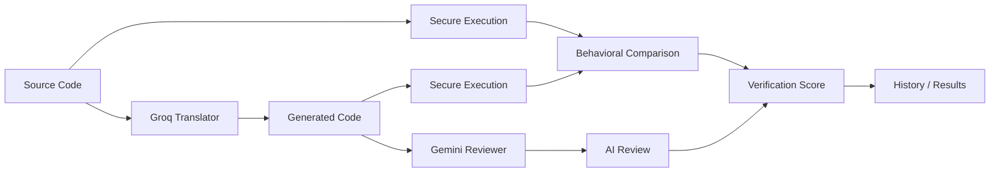

# <h1 align="center">📚 CodeProof - AI-Verified Legacy Code Migration</h1>

CodeProof is a MERN application for migrating legacy source code and proving, as far as executable tests can establish, that the translated program preserves the original behavior.

## Core pipeline



The project deliberately does **not** mark a translation verified from an LLM opinion alone. The final state is driven primarily by compilation, execution and behavioral comparison.

## Stack
- React + Vite + Tailwind CSS
- React Router, Axios, Monaco Editor, Lucide, Recharts
- Node.js + Express
- MongoDB + Mongoose
- Clerk authentication with session tokens verified by the Express backend
- Groq for translation, Gemini for verification/fallback translation
- Docker sandbox for C/C++/Java/Python execution

## Requirements
- Node.js 20.19+ (Vite requirement)
- MongoDB 6+
- Docker Engine/Desktop for secure execution
- Groq API key and/or Gemini API key for live AI mode

## Setup

```bash
cp .env.example .env
npm run install:all
npm install
npm run dev
```

Frontend: http://localhost:5173
Backend: http://localhost:5000

### MongoDB
Create a local database or use MongoDB Atlas. Put its URI in `MONGODB_URI`.

### AI
- `GROQ_API_KEY` / `GROQ_MODEL` control primary translation.
- `GEMINI_API_KEY` / `GEMINI_MODEL` control review and translation fallback.

### Execution
Recommended:

```env
EXECUTION_MODE=docker
```

The sandbox uses `--network none`, read-only root filesystem where possible, capped memory/CPU, a non-root image, a timeout and a temporary working directory. The service never receives application secrets.

For a laptop without Docker, the project includes a clearly marked `local-dev` execution mode for development only. It must not be used on an internet-facing production server.

### Demo mode
Set `DEMO_MODE=true` to use built-in sample migrations when external services are unavailable. Demo output is visibly labelled and is never reported as real verification.

## Supported language pairs
C→C++, C→Java, C→Python, C++→C, C++→Java, C++→Python, Java→C++, Java→Python, Java→C, Python→Java, Python→C++, Python→C, PL/SQL→Java, PL/SQL→Python.

PL/SQL translation is supported; execution is only enabled when an Oracle-compatible runtime is configured. The application reports that limitation rather than claiming false execution coverage.

## Security
- Helmet, CORS allow-list and rate limiting
- Zod request validation and strict request-size limits
- Clerk-managed sign-up, sign-in, session management, and profile security
- HTTP-only JWT cookie
- No provider API keys in the browser
- Docker sandbox with no network and bounded resources
- Temporary files removed after execution
- Error messages are sanitized for normal users

## Scripts
From the repository root:
- `npm run dev` — frontend + backend
- `npm run build` — production frontend build
- `npm run test` — backend tests

## Deployment
Deploy the React client to Vercel or a static host. Deploy the Express API to a Node-compatible VM/container platform. Run the execution service on a host where Docker is available; do not assume serverless functions can safely launch Docker sandboxes.

See `docs/deployment.md` and `docs/security.md`.

## Clerk Authentication

CodeProof now uses Clerk for authentication. The React frontend uses `@clerk/react`, while the Express API uses `@clerk/express` to verify Clerk session tokens. Local MongoDB users are still retained as the application profile/data layer; on first authenticated API request, a Clerk user is linked or created in MongoDB.

### Clerk environment variables

Client (`client/.env`):

```env
VITE_CLERK_PUBLISHABLE_KEY=pk_test_...
VITE_API_URL=http://localhost:5000/api
```

Server (`server/.env`):

```env
CLERK_SECRET_KEY=sk_test_...
```

Never expose `CLERK_SECRET_KEY` to the frontend.

See [docs/clerk.md](docs/clerk.md) for Clerk setup and migration details.

## Authentication

Clerk handles authentication. Enable Google, email/password, and phone OTP in the Clerk Dashboard; see `docs/clerk.md` for the exact settings.

## Clerk CLI authentication setup

This repository is already wired for Clerk. To link it to the provided Clerk application, use the current CLI flow:

```bash
npm install -g clerk
clerk auth login
clerk link --app app_3JJgLmuXkrEgyMmPcZcqWVw4kwR
clerk init
clerk doctor
```

See `docs/clerk-cli.md` for the complete setup and migration notes.

## Verification Report

Results can be exported as a self-contained HTML verification report or printed to PDF. The report includes AI review metadata, behavioral verification metrics, source/target code, and detailed test evidence. See `docs/verification-report.md`.


## Language support update

CodeProof supports C, C++, Java, Python, PHP, PL/SQL, and COBOL in the language selectors. PHP has a Docker execution adapter, COBOL uses a local GnuCOBOL sandbox image built from the included Dockerfile, and PL/SQL remains translation/review-only without an Oracle-compatible runtime.
