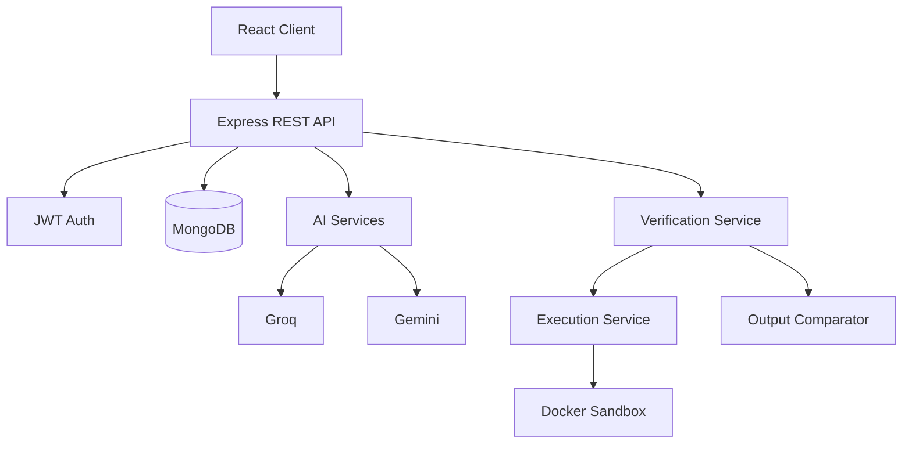

# CodeProof Architecture

## Trust boundaries
1. Browser → API: authenticated HTTPS requests.
2. API → providers: server-side secrets only.
3. API → execution: untrusted user code crosses into a containerized sandbox.
4. Database stores translation metadata, code, tests and verification artifacts.
