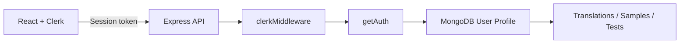

# Clerk Authentication

CodeProof uses Clerk as the authentication provider.

## Architecture



The browser uses `@clerk/react`. API requests obtain a Clerk session token with the React `getToken()` helper and send it as an `Authorization: Bearer <token>` header. The Express server installs `clerkMiddleware()` and the protected middleware uses `getAuth(req)` to identify the signed-in Clerk user. Clerk's backend client is used only when CodeProof needs to resolve the Clerk user profile.

## Environment variables

### Client

Create `client/.env`:

```env
VITE_CLERK_PUBLISHABLE_KEY=pk_test_...
VITE_API_URL=http://localhost:5000/api
```

### Server

Create `server/.env`:

```env
CLERK_SECRET_KEY=sk_test_...
```

Keep `CLERK_SECRET_KEY` only on the backend. Never put it in `client/.env` or any Vite source.

## Clerk Dashboard

Create a Clerk application and configure the sign-in methods you want. For email/password, enable the corresponding identifier and password options in the Clerk Dashboard. You can also enable social connections such as Google or GitHub without changing CodeProof's API authentication code.

For local development, use the development instance and its development keys. Before production, claim/configure the Clerk application and use production keys.

## MongoDB migration behavior

CodeProof keeps the MongoDB `User` document because application data such as translations and preferences are linked to it. The user model now stores `clerkUserId`.

On the first authenticated API request:

1. CodeProof reads the Clerk `userId` from the validated session.
2. It looks for a MongoDB user with that `clerkUserId`.
3. If absent, it retrieves the Clerk user profile.
4. It links an existing MongoDB user with the same email when possible, otherwise creates the local profile.

This allows existing CodeProof data to survive the authentication migration instead of being tied to the old application-managed JWT/password flow.

## Run

```bash
npm install
npm run install:all
npm run dev
```

Then open `http://localhost:5173/login`.


## Enable Google + Email/Password + Phone OTP

CodeProof uses Clerk's prebuilt `<SignIn />` and `<SignUp />` components. These components render the authentication methods enabled for the Clerk instance, so the three methods are configured in the Clerk Dashboard rather than hard-coded into React.

### 1. Email + password

In Clerk Dashboard:

`User & authentication → Email`

Enable:
- Sign-up with email
- Sign-in with email
- Email verification code (recommended for verification)

Then under:

`User & authentication → Password`

Enable:
- Sign-up with password

Clerk's documentation confirms that the email identifier and password settings are separate controls. citeturn943961search0turn943961search6

### 2. Phone number + SMS OTP

Go to:

`User & authentication → Phone`

Enable:
- Sign-up with phone
- Sign-in with phone
- Verify at sign-up

Phone authentication uses an SMS one-time code. Clerk notes that phone authentication is available in development for testing and requires a paid plan for production use. citeturn943961search0turn943961search3

### 3. Google

Go to:

`SSO connections → Add connection → For all users → Google`

Enable Google for sign-up and sign-in.

For a development Clerk instance, Clerk provides shared Google OAuth credentials/redirect URIs. For production, configure the production Google OAuth credentials and redirect URI shown by Clerk. citeturn943961search8

### Expected CodeProof sign-in experience

With those three methods enabled, the existing CodeProof `<SignIn />` component will expose the configured options, including Google and the available email/phone sign-in flows. The backend does not need a separate Google/phone authentication endpoint because Clerk validates the resulting session before CodeProof accepts API requests. citeturn943961search0turn943961search4

### Important

The exact buttons/options shown by Clerk depend on the authentication settings of the Clerk instance. The repository cannot turn on Google OAuth or SMS delivery by itself; those provider and identifier settings must be enabled in the Clerk Dashboard.
